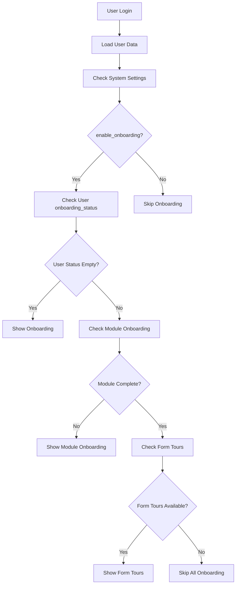

# Frappe Onboarding System: Complete Analysis and Solutions to Disable It 

## Overview

The Frappe onboarding system is a multi-layered mechanism designed to guide new users through the application. However, it can sometimes show onboarding pages even when disabled in System Settings, creating confusion for administrators and users.

## System Architecture

### Core Components

#### 1. **System Settings Layer**
- **Field**: `enable_onboarding` (Checkbox)
- **Location**: System Settings DocType
- **Purpose**: Global toggle for module onboarding
- **Scope**: System-wide control

#### 2. **User Onboarding Status Layer**
- **Field**: `onboarding_status` (JSON)
- **Location**: User DocType
- **Purpose**: Individual user completion tracking
- **Scope**: Per-user basis

#### 3. **Module Onboarding Layer**
- **DocType**: Module Onboarding
- **Purpose**: Module-specific onboarding steps
- **Scope**: Per-module configuration

#### 4. **Form Tours Layer**
- **DocType**: Form Tour
- **Purpose**: UI tours and interactive guides
- **Scope**: Per-form/page basis

#### 5. **Onboarding Steps Layer**
- **DocType**: Onboarding Step
- **Purpose**: Individual step definitions
- **Scope**: Granular step control

### Data Flow Architecture



## The Problem Scenario

### Common Issue
> "When I create a new user, it sends them to the onboarding page even if I disabled onboarding in System Settings."

### Symptoms
- New users see onboarding pages despite `enable_onboarding = 0`
- System Settings show onboarding as disabled
- Users get stuck in onboarding loops
- Inconsistent behavior across different user types

### Root Causes
1. **Multiple Control Layers**: System Settings only control one layer
2. **User Status Inheritance**: New users inherit empty onboarding status
3. **Cache Issues**: Old onboarding data cached in browser/session
4. **Module Dependencies**: Some modules force onboarding regardless of settings
5. **Form Tour Override**: Form tours can trigger independently

## Why This Happens

### 1. **Layered Control System**

Frappe uses a **hierarchical control system** where each layer can override the previous:

```python
# Layer 1: System Settings (Global)
enable_onboarding = frappe.get_system_settings("enable_onboarding")

# Layer 2: User Status (Individual)
user_status = frappe.db.get_value("User", user, "onboarding_status")

# Layer 3: Module Onboarding (Per-module)
module_complete = frappe.db.get_value("Module Onboarding", module, "is_complete")

# Layer 4: Form Tours (Per-form)
form_tours = frappe.get_all("Form Tour", filters={"ui_tour": 1})
```

### 2. **New User Creation Process**

When a new user is created:

```python
# Default user creation process
def create_user():
    user = frappe.new_doc("User")
    user.email = "new@example.com"
    user.enabled = 1
    user.save()
    
    # onboarding_status is NULL by default
    # This triggers onboarding logic
```

### 3. **Onboarding Logic Flow**

```python
# From frappe/desk/desktop.py
def get_onboarding_doc(self, onboarding):
    # Check if onboarding is enabled
    if not frappe.get_system_settings("enable_onboarding"):
        return None  # This should skip onboarding
    
    # But other checks can still trigger it...
    if not self.onboarding_list:
        return None
    
    # Module completion check
    if frappe.db.get_value("Module Onboarding", onboarding, "is_complete"):
        return None
    
    # User role check
    allowed_roles = set(doc.get_allowed_roles())
    user_roles = set(frappe.get_roles())
    if not allowed_roles & user_roles:
        return None
    
    # This is where it can still return onboarding doc
    return doc
```

### 4. **Frontend JavaScript Logic**

```javascript
// From onboarding_tours.js
frappe.ui.init_onboarding_tour = () => {
    // Check user onboarding status
    if (frappe.boot.user.onboarding_status[tour[0]]?.is_complete == true) 
        return false;
    
    // If status is empty/null, show onboarding
    if (!frappe.boot.user.onboarding_status[tour[0]]) {
        // Show onboarding
    }
}
```

## How Frappe Handles Onboarding

### 1. **Backend Processing**

#### User Login Process
```python
# From frappe/auth.py - LoginManager class
def post_login(self, session_end: str | None = None, audit_user: str | None = None):
    self.run_trigger("on_login")
    validate_ip_address(self.user)
    self.validate_hour()
    self.get_user_info()
    self.make_session(session_end=session_end, audit_user=audit_user)
    self.setup_boot_cache()
    self.set_user_info()
```

#### Boot Process
```python
# From frappe/boot.py
def get_bootinfo():
    """build and return boot info"""
    frappe.set_user_lang(frappe.session.user)
    bootinfo = frappe._dict()
    hooks = frappe.get_hooks()
    doclist = []

    # user
    get_user(bootinfo)

    # system info
    bootinfo.sitename = frappe.local.site
    bootinfo.sysdefaults = frappe.defaults.get_defaults()
    bootinfo.sysdefaults["setup_complete"] = frappe.is_setup_complete()

    if frappe.session["user"] != "Guest":
        bootinfo.user_info = get_user_info()

    # ... other boot data ...
    bootinfo.onboarding_tours = get_onboarding_ui_tours()  # This loads onboarding tours
```

#### Onboarding Status Check
```python
# From frappe/onboarding.py
@frappe.whitelist()
def get_onboarding_status():
    onboarding_status = frappe.db.get_value("User", frappe.session.user, "onboarding_status")
    return frappe.parse_json(onboarding_status) if onboarding_status else {}
```

### 2. **Frontend Processing**

#### Boot Process
```javascript
// From frappe/sessions.py
def get():
    """get session boot info"""
    from frappe.boot import get_bootinfo, get_unseen_notes
    from frappe.utils.change_log import get_change_log

    bootinfo = None
    if not getattr(frappe.conf, "disable_session_cache", None):
        # check if cache exists
        bootinfo = frappe.cache.hget("bootinfo", frappe.session.user)
        if bootinfo:
            bootinfo["from_cache"] = 1
            bootinfo["user"]["recent"] = json.dumps(frappe.cache.hget("user_recent", frappe.session.user))

    if not bootinfo:
        # if not create it
        bootinfo = get_bootinfo()
        frappe.cache.hset("bootinfo", frappe.session.user, bootinfo)
```

#### Tour Initialization
```javascript
// From onboarding_tours.js
frappe.ui.init_onboarding_tour = () => {
    // Multiple checks determine if onboarding should show
    let matching_tours = [];
    
    // Filter tours based on completion status
    matching_tours = matching_tours.filter((tour) => {
        if (frappe.boot.user.onboarding_status[tour[0]]?.is_complete == true) 
            return false;
        return true;
    });
    
    // If tours match, show onboarding
    if (matching_tours.length > 0) {
        // Start onboarding
    }
}
```

### 3. **Module Onboarding Logic**

```python
# From module_onboarding.py
def check_completion(self):
    if self.is_complete:
        return True
    
    steps = self.get_steps()
    is_complete = [bool(step.is_complete or step.is_skipped) for step in steps]
    
    if all(is_complete):
        self.is_complete = True
        self.save(ignore_permissions=True)
        return True
    
    return False
```

## Complete Solutions

### Solution 1: System-Wide Complete Disable

#### Backend Implementation
```python
# In your app's install.py or custom script
import frappe

def disable_all_onboarding():
    """Completely disable all onboarding layers"""
    
    # 1. Disable system-wide onboarding
    frappe.db.set_single_value("System Settings", "enable_onboarding", 0)
    
    # 2. Clear onboarding status for all users
    users = frappe.get_all("User", filters={"enabled": 1}, pluck="name")
    for user in users:
        frappe.db.set_value("User", user, "onboarding_status", "{}")
        frappe.cache.hdel("bootinfo", user)
    
    # 3. Mark all module onboardings as complete
    module_onboardings = frappe.get_all("Module Onboarding", pluck="name")
    for module in module_onboardings:
        frappe.db.set_value("Module Onboarding", module, "is_complete", 1)
    
    # 4. Disable all form tours
    form_tours = frappe.get_all("Form Tour", pluck="name")
    for tour in form_tours:
        frappe.db.set_value("Form Tour", tour, "ui_tour", 0)
    
    frappe.db.commit()
    print("All onboarding layers disabled successfully")
```

#### Frontend Override
```javascript
// In your app's public JS file
// Override onboarding initialization
frappe.ui.init_onboarding_tour = function() {
    // Completely disable onboarding tours
    return;
};

// Override onboarding widget
frappe.widgets.OnboardingWidget = class {
    refresh() {
        // Hide onboarding widgets
        this.element.hide();
        return;
    }
};

// Override module onboarding
frappe.workspace.get_onboardings = function() {
    return [];
};
```

### Solution 2: User Creation Hook

#### Hook Configuration
```python
# In hooks.py
doc_events = {
    "User": {
        "after_insert": "your_app.utils.user.disable_user_onboarding"
    }
}
```

#### User Utility
```python
# In your_app/utils/user.py
import frappe

def disable_user_onboarding(doc, method):
    """Disable onboarding for newly created users"""
    if not doc.enabled:
        return
    
    # Ensure system onboarding is disabled
    if frappe.get_system_settings("enable_onboarding"):
        frappe.db.set_single_value("System Settings", "enable_onboarding", 0)
    
    # Clear onboarding status for the new user
    frappe.db.set_value("User", doc.name, "onboarding_status", "{}")
    
    # Clear user's bootinfo cache
    frappe.cache.hdel("bootinfo", doc.name)
    
    frappe.db.commit()
    print(f"Onboarding disabled for new user: {doc.name}")
```

### Solution 3: Role-Based Control

```python
# In your_app/utils/user.py
def disable_user_onboarding_by_role(doc, method):
    """Disable onboarding based on user roles"""
    if not doc.enabled:
        return
    
    # Define roles that should skip onboarding
    skip_onboarding_roles = [
        "System Manager",
        "Administrator", 
        "Employee",
        "Customer",
        "Supplier"
    ]
    
    user_roles = frappe.get_roles(doc.name)
    
    # Check if user has any role that should skip onboarding
    if any(role in skip_onboarding_roles for role in user_roles):
        # Clear onboarding status
        frappe.db.set_value("User", doc.name, "onboarding_status", "{}")
        frappe.cache.hdel("bootinfo", doc.name)
        frappe.db.commit()
        print(f"Onboarding disabled for user {doc.name} with roles: {user_roles}")
```

### Solution 4: Custom User Class Override

```python
# In your_app/utils/user.py
import frappe
from frappe.core.doctype.user.user import User

class CustomUser(User):
    def after_insert(self):
        super().after_insert()
        self.disable_onboarding()
    
    def disable_onboarding(self):
        """Disable onboarding for this user"""
        if not self.enabled:
            return
        
        # Clear onboarding status
        frappe.db.set_value("User", self.name, "onboarding_status", "{}")
        frappe.cache.hdel("bootinfo", self.name)
        frappe.db.commit()
        print(f"Onboarding disabled for user: {self.name}")
```

#### Hook Configuration
```python
# In hooks.py
override_doctype_class = {
    "User": "your_app.utils.user.CustomUser"
}
```

### Solution 5: Database-Level Fix

```sql
-- Direct database approach (use with caution)
-- Disable system onboarding
UPDATE `tabSingles` 
SET `value` = '0' 
WHERE `doctype` = 'System Settings' 
AND `field` = 'enable_onboarding';

-- Clear all user onboarding status
UPDATE `tabUser` 
SET `onboarding_status` = '{}' 
WHERE `enabled` = 1;

-- Mark all module onboardings as complete
UPDATE `tabModule Onboarding` 
SET `is_complete` = 1;

-- Disable all form tours
UPDATE `tabForm Tour` 
SET `ui_tour` = 0;
```

### Solution 6: Cache Management

```python
# In your_app/utils/cache.py
import frappe

def clear_onboarding_cache():
    """Clear all onboarding-related cache"""
    
    # Clear user bootinfo cache
    users = frappe.get_all("User", filters={"enabled": 1}, pluck="name")
    for user in users:
        frappe.cache.hdel("bootinfo", user)
    
    # Clear system cache
    frappe.clear_cache()
    frappe.clear_website_cache()
    
    # Clear specific caches
    frappe.cache.delete_key("onboarding_status")
    frappe.cache.delete_key("module_onboarding")
    
    print("Onboarding cache cleared successfully")
```

## Best Practices

### 1. **Layered Approach**
- Always check multiple layers when disabling onboarding
- Use hooks for automatic user handling
- Implement both backend and frontend controls

### 2. **User Experience**
- Provide clear feedback when onboarding is disabled
- Consider role-based onboarding (some users might need it)
- Implement graceful fallbacks

### 3. **Maintenance**
- Regular cache clearing
- Monitor onboarding status in logs
- Test with different user types

### 4. **Security**
- Validate user permissions before disabling
- Use proper error handling
- Log onboarding changes for audit

## Troubleshooting

### Common Issues

#### Issue 1: Onboarding Still Shows After Disable
**Symptoms**: Users still see onboarding despite disabling
**Causes**: Cache issues, multiple layers not disabled
**Solutions**:
```python
# Clear all caches
frappe.clear_cache()
bench --site your-site clear-cache
bench --site your-site build
```

#### Issue 2: New Users Still Get Onboarding
**Symptoms**: Newly created users see onboarding
**Causes**: User creation hook not working
**Solutions**:
```python
# Check hook configuration
# Verify doc_events in hooks.py
# Test user creation process
```

#### Issue 3: Form Tours Still Active
**Symptoms**: UI tours still appear
**Causes**: Form tours not disabled
**Solutions**:
```python
# Disable form tours
frappe.db.set_value("Form Tour", tour_name, "ui_tour", 0)
```

#### Issue 4: Module Onboarding Persists
**Symptoms**: Module-specific onboarding shows
**Causes**: Module onboarding not marked complete
**Solutions**:
```python
# Mark module onboarding as complete
frappe.db.set_value("Module Onboarding", module_name, "is_complete", 1)
```

### Debugging Commands

```python
# Check system settings
frappe.get_system_settings("enable_onboarding")

# Check user status
user = frappe.get_doc("User", "user@example.com")
print(user.onboarding_status)

# Check module onboarding
modules = frappe.get_all("Module Onboarding", fields=["name", "is_complete"])
print(modules)

# Check form tours
tours = frappe.get_all("Form Tour", filters={"ui_tour": 1})
print(tours)

# Clear specific user cache
frappe.cache.hdel("bootinfo", "user@example.com")
```

### Verification Steps

1. **System Level**:
   ```python
   frappe.get_system_settings("enable_onboarding")  # Should be 0
   ```

2. **User Level**:
   ```python
   user = frappe.get_doc("User", "user@example.com")
   print(user.onboarding_status)  # Should be {} or empty
   ```

3. **Module Level**:
   ```python
   modules = frappe.get_all("Module Onboarding", fields=["name", "is_complete"])
   # All should have is_complete = 1
   ```

4. **Frontend Level**:
   - Check browser console for onboarding errors
   - Verify no onboarding widgets are visible
   - Test user login flow

## Conclusion

The Frappe onboarding system is complex with multiple layers of control. The key to solving onboarding issues is understanding that **System Settings alone is not sufficient** - you need to address all layers:

1. **System Settings** (Global toggle)
2. **User Status** (Individual tracking)
3. **Module Onboarding** (Per-module)
4. **Form Tours** (UI guides)
5. **Cache Management** (Performance)

By implementing a comprehensive solution that addresses all layers, you can ensure that onboarding behaves consistently across your Frappe application.
