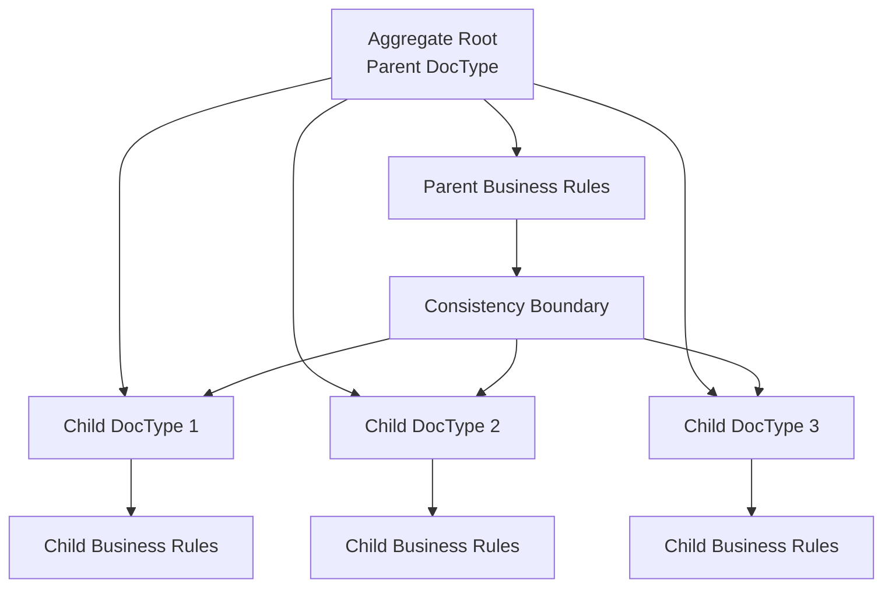
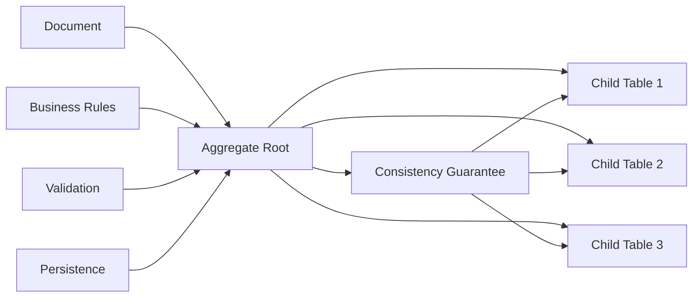

# The Philosophy and Theory Behind Frappe Child DocTypes

## Table of Contents
- **1. [Conceptual Foundation**
- **2. [Theoretical Framework**
- **3. [Design Philosophy**
- **4. [Architectural Patterns**
- **5. [Data Modeling Principles**
- **6. [Implementation Philosophy**
- **7. [Evolution and Future**

## Conceptual Foundation

### What is a Child DocType?

A **Child DocType** in Frappe is not just a technical implementation detail—it represents a fundamental **philosophical approach** to data modeling and application architecture. At its core, a child doctype embodies the principle of **composition over inheritance** and implements the **aggregate pattern** from Domain-Driven Design.

### The Three Pillars of Child DocTypes

#### 1. **Structural Integrity**
Child doctypes maintain **referential integrity** through a three-field system:
- `parent`: The unique identifier of the parent document
- `parenttype`: The doctype of the parent (ensuring type safety)
- `parentfield`: The specific field in the parent where this child belongs

This creates a **triple-key constraint** that ensures data consistency and prevents orphaned records.

#### 2. **Semantic Meaning**
Unlike simple foreign keys, child doctypes carry **semantic meaning** about the relationship:
- They represent **part-of** relationships, not **has-a** relationships
- They maintain **lifecycle dependency** on their parent
- They inherit **business context** from their parent

#### 3. **Operational Coherence**
Child doctypes operate as **atomic units** within their parent's transaction boundary:
- They cannot exist independently
- They share the parent's **docstatus** (draft, submitted, cancelled)
- They participate in the parent's **validation and business logic**

## Theoretical Framework

### The Aggregate Pattern

Frappe's child doctype system implements the **Aggregate Pattern** from Domain-Driven Design:



**Key Principles:**
- **Consistency Boundary**: All child records must be consistent with parent rules
- **Transaction Boundary**: Parent and children are saved/updated atomically
- **Lifecycle Management**: Children cannot outlive their parent
- **Business Logic Encapsulation**: Each child can have its own validation rules

### The Composition Pattern

Child doctypes implement **composition over inheritance**:

```python
# Instead of inheritance (BAD):
class SalesOrderItem(Item):
    quantity = 0
    rate = 0
    # Problem: Tight coupling, complex inheritance hierarchy

# Frappe uses composition (GOOD):
class SalesOrder(Document):
    items = []  # Child table of Sales Order Item
    
class SalesOrderItem(Document):
    parent = "SAL-001"  # Reference to parent
    item_code = "ITEM-001"
    quantity = 10
    rate = 100
    # Benefit: Loose coupling, flexible relationships
```

### The Repository Pattern

Child doctypes implement a **specialized repository pattern**:

```python
# Child records are accessed through parent context
parent_doc = frappe.get_doc("Sales Order", "SAL-001")
child_items = parent_doc.items  # Repository-like access

# Direct access requires parent context
child_doc = frappe.get_doc("Sales Order Item", "SAL-001-ITEM-001")
# Automatically knows its parent context
```

## Design Philosophy

### 1. **Simplicity Through Complexity**

The child doctype system appears complex on the surface but provides **simplicity at the application level**:

```python
# Complex underlying implementation
class ChildQuery:
    def get_query(self, parent_names=None):
        filters = {
            "parenttype": self.parent_doctype,
            "parentfield": self.fieldname,
            "parent": ["in", parent_names],
        }
        return frappe.qb.get_query(...)

# Simple application usage
doc.append("items", {"item_code": "ITEM-001", "qty": 10})
```

### 2. **Convention Over Configuration**

Child doctypes follow **strong conventions** that reduce configuration:

- **Naming**: `parent`, `parenttype`, `parentfield` are mandatory
- **Indexing**: Automatic indexing on parent fields
- **Permissions**: Inherited from parent doctype
- **Validation**: Automatic parent-child relationship validation

### 3. **Progressive Disclosure**

The system reveals complexity **progressively**:

1. **Basic Level**: Simple append/remove operations
2. **Intermediate Level**: Custom validation and business logic
3. **Advanced Level**: Custom queries and complex relationships
4. **Expert Level**: Direct database manipulation and optimization

### 4. **Fail-Safe Design**

Child doctypes are designed to **fail safely**:

```python
# Automatic cleanup on parent deletion
def on_trash(self):
    # Child records are automatically deleted
    # No orphaned records possible
    
# Automatic validation
def validate(self):
    # Parent-child relationship is always valid
    # Business rules are enforced
```

## Architectural Patterns

### 1. **The Document-Aggregate Pattern**



**Benefits:**
- **Data Consistency**: All related data is kept consistent
- **Transaction Safety**: Atomic operations across parent and children
- **Business Logic Encapsulation**: Rules are enforced at the aggregate level

### 2. **The Observer Pattern**

Child doctypes implement the **Observer Pattern** for event handling:

```python
# Parent events trigger child events
def on_update(self):
    # Parent updated
    for child in self.items:
        child.on_parent_update()  # Child observes parent changes

def on_submit(self):
    # Parent submitted
    for child in self.items:
        child.on_parent_submit()  # Child reacts to parent state
```

### 3. **The Strategy Pattern**

Different child doctypes can implement different **strategies** for the same parent:

```python
# Different item types with different strategies
class SalesOrderItem(Document):
    def calculate_amount(self):
        return self.qty * self.rate

class ServiceOrderItem(Document):
    def calculate_amount(self):
        return self.hours * self.hourly_rate

# Same parent, different calculation strategies
```

## Data Modeling Principles

### 1. **Normalization Through Denormalization**

Child doctypes achieve **normalization** through **controlled denormalization**:

```sql
-- Normalized approach (traditional)
CREATE TABLE sales_orders (
    name VARCHAR(255) PRIMARY KEY,
    customer VARCHAR(255),
    total DECIMAL(10,2)
);

CREATE TABLE sales_order_items (
    id INT PRIMARY KEY,
    sales_order_id VARCHAR(255),
    item_code VARCHAR(255),
    quantity INT,
    rate DECIMAL(10,2),
    FOREIGN KEY (sales_order_id) REFERENCES sales_orders(name)
);

-- Frappe's child doctype approach
CREATE TABLE `tabSales Order` (
    name VARCHAR(255) PRIMARY KEY,
    customer VARCHAR(255),
    total DECIMAL(10,2)
);

CREATE TABLE `tabSales Order Item` (
    name VARCHAR(255) PRIMARY KEY,
    parent VARCHAR(255),
    parenttype VARCHAR(255),
    parentfield VARCHAR(255),
    item_code VARCHAR(255),
    quantity INT,
    rate DECIMAL(10,2),
    idx INT,
    INDEX(parent, parenttype, parentfield)
);
```

**Benefits:**
- **Flexibility**: Easy to add new child types
- **Performance**: Optimized queries with proper indexing
- **Consistency**: Built-in referential integrity

### 2. **The Single Source of Truth Principle**

Each piece of data has **exactly one authoritative source**:

```python
# Parent owns the business context
parent_doc.customer = "CUST-001"
parent_doc.status = "Draft"

# Children own their specific data
child_doc.item_code = "ITEM-001"
child_doc.quantity = 10

# No duplication of business context
# No conflicting sources of truth
```

### 3. **The Principle of Least Surprise**

Child doctypes behave **predictably**:

```python
# Expected behavior
doc.append("items", {"item_code": "ITEM-001"})
assert doc.items[0].parent == doc.name
assert doc.items[0].parenttype == "Sales Order"
assert doc.items[0].parentfield == "items"

# No surprises, no hidden magic
```

## Implementation Philosophy

### 1. **Lazy Loading and Eager Loading**

Child doctypes support **both loading strategies**:

```python
# Lazy loading (default)
doc = frappe.get_doc("Sales Order", "SAL-001")
items = doc.items  # Loaded when accessed

# Eager loading (when needed)
doc = frappe.get_doc("Sales Order", "SAL-001", with_children=True)
items = doc.items  # Already loaded
```

### 2. **Immutable Identity**

Child records maintain **immutable identity**:

```python
# Identity is stable
child_doc.name = "SAL-001-ITEM-001"  # Never changes
child_doc.parent = "SAL-001"          # Never changes
child_doc.parenttype = "Sales Order"  # Never changes

# Only business data can change
child_doc.quantity = 20  # This can change
```

### 3. **Event-Driven Architecture**

Child doctypes participate in **event-driven workflows**:

```python
# Parent events cascade to children
def on_update(self):
    for item in self.items:
        item.trigger("parent_updated")

def on_submit(self):
    for item in self.items:
        item.trigger("parent_submitted")
```

### 4. **Graceful Degradation**

The system **degrades gracefully** when things go wrong:

```python
# If parent is deleted, children are automatically cleaned up
# If validation fails, the entire transaction is rolled back
# If permissions are insufficient, access is denied consistently
```

## Evolution and Future

### 1. **Adaptability**

The child doctype system is designed to **evolve**:

- **New field types** can be added without breaking existing code
- **New validation rules** can be implemented incrementally
- **New business logic** can be added without affecting existing functionality

### 2. **Scalability**

The architecture supports **horizontal and vertical scaling**:

- **Database partitioning** by parent doctype
- **Caching strategies** for frequently accessed child data
- **Async processing** for complex child operations

### 3. **Extensibility**

The system is **highly extensible**:

```python
# Custom child doctype behavior
class CustomSalesOrderItem(SalesOrderItem):
    def custom_validation(self):
        # Custom business logic
        pass
    
    def custom_calculation(self):
        # Custom calculations
        pass
```

## Conclusion

The Frappe child doctype system represents a **mature, well-thought-out approach** to data modeling that balances:

- **Simplicity** for basic use cases
- **Power** for complex scenarios
- **Consistency** across the application
- **Flexibility** for future growth

It embodies the principle that **good architecture is not about choosing the right technology, but about choosing the right abstractions** that make complex problems simple to understand and solve.

The child doctype system is not just a technical feature—it's a **philosophical commitment** to building applications that are:
- **Maintainable** over time
- **Understandable** by developers
- **Extensible** for future needs
- **Reliable** in production

This is the true power and beauty of Frappe's child doctype system.
