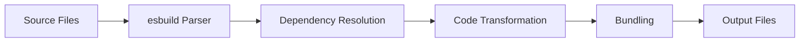
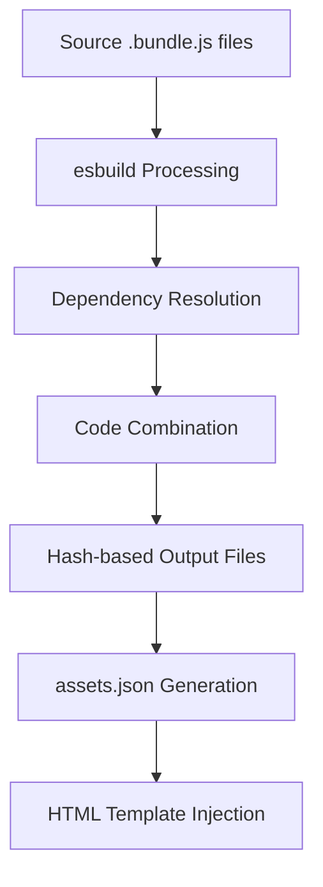
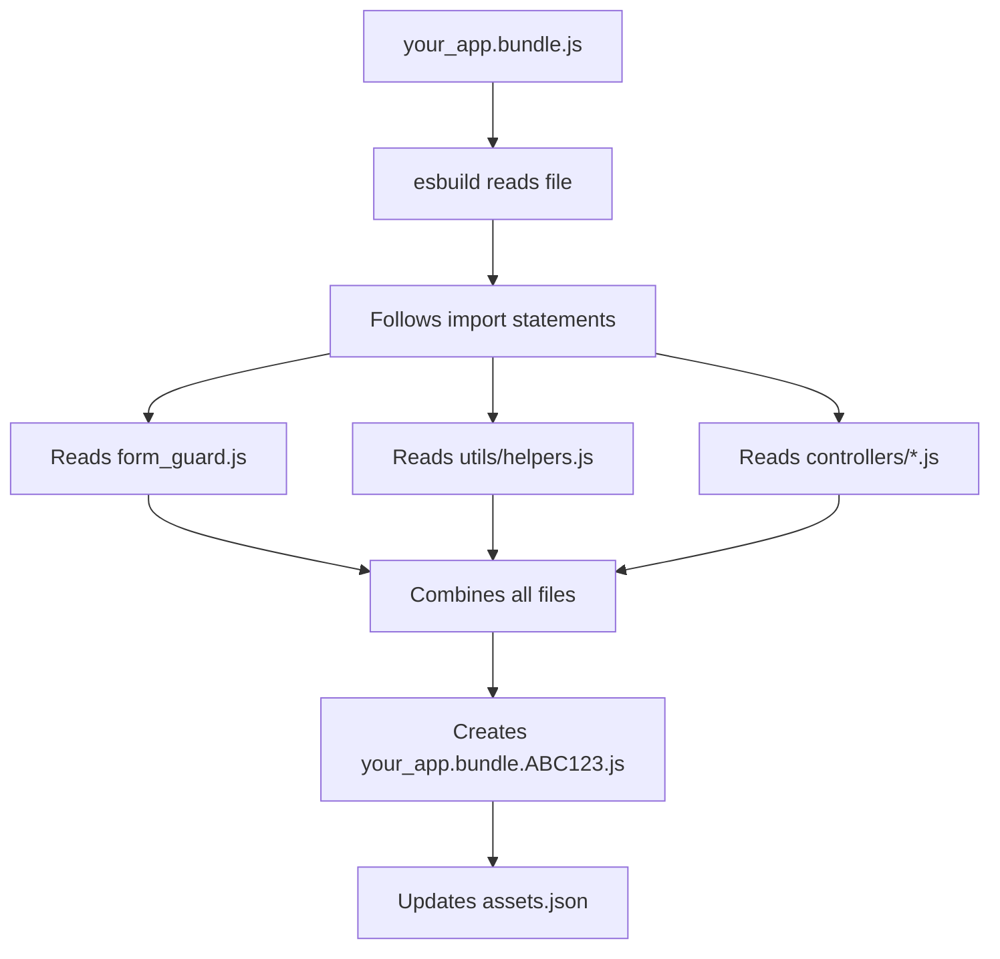
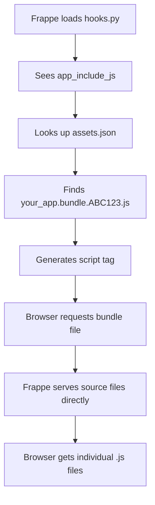
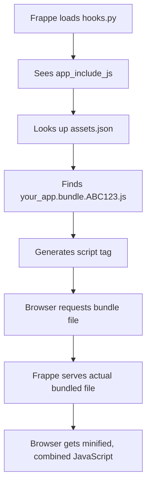

# Frappe Framework: JavaScript Bundling

## Table of Contents
- **1. What is Bundling?**
- **2. Why Do We Need Bundling?**
- **3. What is esbuild?**
- **4. Bundling vs Raw JavaScript Files**
- **5. How Frappe Implements Bundling**
- **6. When and Why to Use Bundles in Frappe**
- **7. Step-by-Step Implementation**
- **8. Advanced Concepts**

---

## What is Bundling?

### Basic Concept
**Bundling** is the process of taking multiple JavaScript files and combining them into a single file (or a few files) that can be loaded by the browser. Think of it like packing a suitcase - instead of carrying 20 small bags, you pack everything into one organized suitcase.

### The Problem Bundling Solves
In the early days of web development, developers would include JavaScript files like this:

```html
<!-- Old way - multiple script tags -->
<script src="jquery.js"></script>
<script src="bootstrap.js"></script>
<script src="my-app.js"></script>
<script src="utils.js"></script>
<script src="controllers.js"></script>
<script src="models.js"></script>
```

**Problems with this approach:**
- **HTTP Requests**: Each file requires a separate network request
- **Loading Order**: Scripts must load in the correct sequence
- **Dependencies**: Hard to manage which file depends on which
- **Performance**: Multiple small files = slower page load
- **Maintenance**: Difficult to track what's actually being used

### What Bundling Does
Bundling transforms this:

```
📁 Source Files:
├── jquery.js (30KB)
├── bootstrap.js (50KB) 
├── my-app.js (10KB)
├── utils.js (5KB)
├── controllers.js (8KB)
└── models.js (3KB)
```

Into this:

```
📦 Bundled Output:
└── app.bundle.js (106KB) - Single file with everything
```

---

## Why Do We Need Bundling?

Bundling addresses four major challenges in modern web development:

### 1. **Improved Performance**
- Combines multiple JavaScript files into a single file
- Reduces HTTP requests (e.g., from 6 to 1)
- Enables better browser caching and compression
- Results in faster page loads and improved user experience

### 2. **Automatic Dependency Management**
- Eliminates manual script ordering (e.g., jQuery → Bootstrap → app.js)
- Automatically resolves and loads dependencies in the correct sequence
- Prevents runtime errors caused by incorrect load order

### 3. **Better Code Organization**
- Supports modular code using modern ES6 modules (`import`/`export`)
- Splits code into logical, maintainable files during development
- Removes unused code (tree-shaking) and minifies output for production

### 4. **Enhanced Development Experience**
- Hot reloading: See changes instantly without full refresh
- Source maps: Debug original source code despite minification
- Improved error messages and stack traces
- Built-in support for TypeScript, JSX, and modern JS features
- All benefits while working with clean, readable source files

**In short:** Bundling makes web apps **faster**, **easier to manage**, **better structured**, and **more enjoyable to develop**.

---

## What is esbuild?

### Definition
**esbuild** is a modern JavaScript bundler written in Go. It's designed to be extremely fast and efficient at bundling JavaScript, TypeScript, and CSS files.

**Frappe** uses **esbuild** for its frontend build process and has developed its own optimized esbuild plugin, **@frappe/esbuild-plugin-postcss2**, for handling **PostCSS**. 

**PostCSS** is a tool that takes your CSS and automatically improves it using plugins. It Can:
- **Add browser prefixes** automatically  
  Example: `display: flex` → `-webkit-flex`,  ox`, e:
- **Minify CSS**  Reduces file size loading
- **Use future CSS features today**  Write modern CSS and let PostCSS convert it to work browse:
- **Automate repetitive tasks**  No more manual fixes or cross-browser tweaks.

**In Simple Terms** PostCSS is like a machine that **polishes your CSS** before it goes live.  
Instead of doing optimizations manually, **plugins do the heavy lifting** for you.

### Why esbuild?
**Traditional bundlers (like Webpack):**
- Written in JavaScript
- Slower build times
- More complex configuration
- Larger memory usage

**esbuild:**
- Written in Go (compiled language)
- 10-100x faster than Webpack
- Simple configuration
- Lower memory usage
- Built specifically for speed

### How esbuild Works


1. **Parsing**: Reads your source files
2. **Dependency Resolution**: Figures out what depends on what
3. **Transformation**: Converts modern JavaScript to browser-compatible code
4. **Bundling**: Combines everything into output files
5. **Optimization**: Minifies and optimizes for production

---

## Bundling vs Raw JavaScript Files

### Raw JavaScript Files (Traditional Approach)

```html
<!-- HTML file -->
<script src="jquery.js"></script>
<script src="bootstrap.js"></script>
<script src="app.js"></script>
```

```javascript
// app.js - must be loaded after jQuery and Bootstrap
$(document).ready(function() {
    // Your code here
});
```

**Problems:**
- Manual dependency management
- Multiple HTTP requests
- No code optimization
- Hard to debug
- No modern JavaScript features
- Difficult to maintain

### Bundled Approach (Modern)

```html
<!-- HTML file - only one script tag -->
<script src="app.bundle.js"></script>
```

```javascript
// app.js - can use modern imports
import $ from 'jquery';
import 'bootstrap';

$(document).ready(function() {
    // Your code here
});
```

**Benefits:**
- Automatic dependency resolution
- Single HTTP request
- Code optimization and minification
- Source maps for debugging
- Modern JavaScript features
- Easy to maintain and scale

---

## How Frappe Implements Bundling

### Frappe's Unique Approach

Frappe doesn't use traditional bundling like most modern web apps. Instead, it uses a **hybrid approach** that combines the best of both worlds:

1. **Bundle Entry Points**: `.bundle.js` files that define dependencies
2. **Build-time Processing**: esbuild processes these at build time
3. **Runtime Resolution**: Frappe resolves the actual bundled files at runtime

### The Frappe Bundle Concept

**What a `.bundle.js` file is NOT:**
- it is Not a traditional webpack bundle
- it is Not a minified output file
- it is Not a final product

**What a `.bundle.js` file IS:**
- it is An **entry point** file
- it is A **dependency manifest**
- it is A **build instruction**
- it is A **source file** that gets processed

### How Frappe's Build System Works



#### Step 1: Bundle Discovery
```javascript
// From frappe/esbuild/esbuild.js line 192
function get_all_files_to_build(apps) {
    let include_patterns = [];
    
    for (let app of apps) {
        let public_path = get_public_path(app);
        // Look for files ending in .bundle.{js,ts,css,scss,etc}
        include_patterns.push(
            path.resolve(public_path, "**", "*.bundle.{js,ts,css,sass,scss,less,styl,jsx}")
        );
    }
    
    return { include_patterns, ignore_patterns };
}
```

#### Step 2: esbuild Processing
```javascript
// From frappe/esbuild/esbuild.js
function build_files({ files, outdir }) {
    let build_plugins = [
        vue(),                    // Vue 3 support
        html_plugin,             // HTML template processing
        build_cleanup_plugin,    // Build cleanup
        vue_style_plugin         // Vue style processing
    ];
    
    return esbuild.build(get_build_options(files, outdir, build_plugins));
}
```

#### Step 3: Output Generation
```javascript
// From frappe/esbuild/esbuild.js
function get_build_options(files, outdir, plugins) {
    return {
        entryPoints: files,           // Your .bundle.js files
        entryNames: "[dir]/[name].[hash]", // Hash-based naming
        target: ["es2017"],           // Browser compatibility
        bundle: true,                 // Bundle all dependencies
        minify: PRODUCTION,           // Production minification
        sourcemap: true               // Development source maps
    };
}
```

#### Step 4: Asset Mapping
```javascript
// From frappe/esbuild/esbuild.js
async function write_assets_json(metafile) {
    let out = {};
    
    for (let output in metafile.outputs) {
        let info = metafile.outputs[output];
        let asset_path = "/" + path.relative(sites_path, output);
        
        if (info.entryPoint) {
            let key = path.basename(info.entryPoint);
            // Map "erpnext.bundle.js" to "/assets/erpnext/js/erpnext.ABC123.js"
            out[key] = asset_path;
        }
    }
    
    // Write to assets.json for runtime resolution
    await fs.promises.writeFile(assets_json_path, JSON.stringify(new_assets_json, null, 4));
}
```

#### Step 5: Runtime Resolution
```python
# From frappe/utils/jinja_globals.py
def bundled_asset(path, rtl=None):
    from frappe.utils import get_assets_json
    
    # If it's a bundle file, resolve the actual path
    if ".bundle." in path and not path.startswith("/assets"):
        bundled_assets = get_assets_json()
        # Convert "erpnext.bundle.js" to "/assets/erpnext/js/erpnext.ABC123.js"
        path = bundled_assets.get(path) or path
    
    return abs_url(path)
```

### Example: ERPNext Bundle

```javascript
// Source: apps/erpnext/erpnext/public/js/erpnext.bundle.js
import "./conf";
import "./utils";
import "./queries";
import "./sms_manager";
import "./utils/party";
import "./controllers/stock_controller";
// ... more imports

// Source: apps/erpnext/erpnext/hooks.py
app_include_js = "erpnext.bundle.js"
```

**What happens during build:**
1. esbuild reads `erpnext.bundle.js`
2. Follows all the `import` statements
3. Combines all imported files
4. Creates `erpnext.bundle.ABC123.js` (with hash)
5. Updates `assets.json` to map the names

**What happens at runtime:**
1. Frappe sees `app_include_js = "erpnext.bundle.js"`
2. Looks up `assets.json` to find the real file
3. Generates `<script src="/assets/erpnext/js/erpnext.ABC123.js"></script>`

> Source files (.js) vs Bundle files (.bundle.js): Edit your actual code in source files (.js) - changes appear immediately with just a browser refresh, no rebuild needed. Only edit bundle files (.bundle.js) when adding new imports or dependencies - these changes require bench build to take effect.
>
> **`.bundle.js`** files are just import lists - they tell the system "include these **`.js`** files" but don't contain your actual code. So when you edit your real code in .js files, changes appear instantly. But when you edit the .bundle.js file (adding/removing imports), you're changing the "shopping list" and need to rebuild for the system to see the new list.
>
> Even though the HTML shows a bundle file (like **your_app.bundle.ABC123.js**), **Frappe** is smart enough to serve your individual source **.js** files directly in **development mode**. So when you edit a **.js** file, you're editing the actual file being served to the browser, not the bundle. The bundle filename is just a "key" that tells Frappe which source files to include. **In production**, it serves the real bundled file; in development, it bypasses the bundle and serves source files directly.

**What Happens in Development Mode:**
- **HTML shows bundle path**: `<script src="/assets/erpnext/js/erpnext.ABC123.js"></script>`
- **But Frappe serves source files directly** instead of the bundle
- **You edit a .js file** → Save it
- **Frappe serves the updated source file** immediately
- **No rebuild needed** - just refresh browser

**What Happens in Production Mode:**
- **HTML shows bundle path**: `<script src="/assets/erpnext/js/erpnext.ABC123.js"></script>`
- **Frappe serves the actual bundled file** (minified, combined)
- **You edit a .js file** → Save it
- **Changes won't appear** because the bundle file is still old
- **Must rebuild** to update the bundle

---

## When and Why to Use Bundles in Frappe

### When to Use Bundles

#### **Use Bundles When:**
- **Multiple Related Files**: You have several JavaScript files that work together
- **Dependencies**: Your code depends on other files or libraries
- **Performance**: You want to reduce HTTP requests
- **Organization**: You want to keep your code modular but load it efficiently
- **Modern JavaScript**: You want to use ES6 modules (`import`/`export`)

#### **Don't Use Bundles When:**
- **Single File**: You have just one small JavaScript file
- **No Dependencies**: Your code doesn't import anything else
- **Simple Scripts**: Basic functionality that doesn't need organization

### Why Use Bundles in Frappe

#### 1. **Performance**
```javascript
// Without bundling - multiple requests
<script src="/assets/myapp/js/utils.js"></script>      // 5KB
<script src="/assets/myapp/js/controllers.js"></script> // 8KB
<script src="/assets/myapp/js/models.js"></script>      // 3KB
// Total: 3 HTTP requests, 16KB

// With bundling - single request
<script src="/assets/myapp/js/app.bundle.ABC123.js"></script>
// Total: 1 HTTP request, 16KB (but loads faster)
```

#### 2. **Dependency Management**
```javascript
// Without bundling - manual order management
// You must ensure utils.js loads before controllers.js
// You must ensure controllers.js loads before models.js

// With bundling - automatic dependency resolution
import { formatCurrency } from './utils';
import { UserController } from './controllers';
import { UserModel } from './models';
// esbuild figures out the correct loading order
```

#### 3. **Code Organization**
```javascript
// You can organize your code into logical files:
// utils.js - utility functions
// controllers.js - business logic
// models.js - data structures
// But load them as one optimized bundle
```

#### 4. **Modern Development**
```javascript
// Use modern JavaScript features
import { debounce } from 'lodash-es';
import { format } from 'date-fns';

// Use ES6 modules
export class UserService {
    async getUsers() {
        // Implementation
    }
}

// Use async/await, arrow functions, etc.
const handleSubmit = async (data) => {
    try {
        const result = await userService.save(data);
        showSuccess('User saved successfully!');
    } catch (error) {
        showError('Failed to save user');
    }
};
```

---

## Step-by-Step Implementation

### 1. **Create Your Bundle Entry Point**

Create: `your_app/public/js/your_app.bundle.js`

```javascript
// This is NOT a traditional bundle - it's an entry point file
// Think of it as a "shopping list" of what to include

// Import your main functionality
import "./form_guard";

// Import utility functions
import "./utils/helpers";
import "./utils/validation";

// Import controllers
import "./controllers/user_controller";
import "./controllers/data_controller";

// Import HTML templates (if any)
import "./templates/notification.html";

// Import from other apps (if needed)
import "frappe/public/js/frappe/form/controls/autocomplete.js";

// Import from node_modules (if available)
import "moment";
import "lodash-es";
```

### 2. **Create Your Source Files**

Create: `your_app/public/js/form_guard.js`

```javascript
// Your main functionality
(function() {
    // Unsaved changes guard
    function attachUnloadGuard(frm) {
        window.onbeforeunload = function(e) {
            if (frm && frm.is_dirty && frm.is_dirty()) {
                e.preventDefault();
                e.returnValue = "";
                return "";
            }
        };
    }

    function clearUnloadGuard() {
        window.onbeforeunload = null;
    }

    // Apply to every doctype
    frappe.ui.form.on('*', {
        onload(frm) {
            clearUnloadGuard();
        },
        refresh(frm) {
            attachUnloadGuard(frm);
        },
        after_save(frm) {
            clearUnloadGuard();
        }
    });
})();
```

Create: `your_app/public/js/utils/helpers.js`

```javascript
// Utility functions
export function formatCurrency(amount, currency = 'USD') {
    return new Intl.NumberFormat('en-US', {
        style: 'currency',
        currency: currency
    }).format(amount);
}

export function debounce(func, wait) {
    let timeout;
    return function executedFunction(...args) {
        const later = () => {
            clearTimeout(timeout);
            func(...args);
        };
        clearTimeout(timeout);
        timeout = setTimeout(later, wait);
    };
}
```

### 3. **Configure Your App Hooks**

In `your_app/hooks.py`:

```python
app_include_js = [
    "your_app.bundle.js"  # This will be processed by esbuild
]
```

### 4. **Build Your Assets**

```bash
# Build just your app
bench build --app your_app

# Or build all apps
bench build

# Clear cache to ensure new assets are loaded
bench clear-cache
```

### 5. **What Happens During Build**



### 6. **What Happens at Runtime**

#### **Development Mode:**


#### **Production Mode:**


---

## Advanced Concepts

### 1. **Multiple Bundles for Different Features**

```python
# In hooks.py
app_include_js = [
    "core.bundle.js",           # Core functionality
    "ui.bundle.js",             # UI components
    "reports.bundle.js",        # Reporting features
    "workflow.bundle.js"        # Workflow engine
]
```

**Benefits:**
- **Code Splitting**: Load only what's needed
- **Better Caching**: Core features change less often
- **Parallel Loading**: Multiple bundles can load simultaneously

### 2. **Conditional Bundle Loading**

```python
# In hooks.py
app_include_js = [
    "base.bundle.js"
]

# Conditional loading based on user permissions
if frappe.has_permission("System Manager"):
    app_include_js.append("admin.bundle.js")
```

### 3. **Cross-App Dependencies**

```javascript
// In your bundle.js
import "frappe/public/js/frappe/form/controls/autocomplete.js";
import "erpnext/public/js/controllers/stock_controller.js";
```

**How it works:**
1. esbuild looks in your app's `node_modules`
2. Then looks in other apps' `public` directories
3. Resolves dependencies automatically

### 4. **HTML Template Import**

```javascript
// In your bundle.js
import "./templates/notification.html";

// esbuild converts this to:
frappe.templates["notification"] = '<div class="notification">...</div>';
```

**Usage in JavaScript:**
```javascript
// Access the template
const template = frappe.templates["notification"];
const html = template.replace('{message}', 'Hello World');
```

---

## Common Questions and Answers

### Q: **Is this like Webpack or Rollup?**
**A**: Similar concept, but Frappe uses esbuild which is much faster and simpler. The main difference is that Frappe bundles are **entry points**, not final outputs.

### Q: **Do I need to understand esbuild?**
**A**: No! Frappe handles all the esbuild configuration. You just create `.bundle.js` files and Frappe does the rest.

### Q: **Can I use npm packages?**
**A**: Yes! Install packages with `yarn add package-name` in your app directory, then import them in your bundle.

### Q: **What about CSS/SCSS?**
**A**: Frappe supports CSS bundling too! Create `your_app.bundle.scss` files and they'll be processed automatically.

### Q: **How do I debug bundled code?**
**A**: Frappe generates source maps automatically. Open browser dev tools and you'll see your original source files, not the bundled version.

### Q: **What's the difference between development and production?**
**A**: 
- **Development**: Unminified code with source maps for debugging
- **Production**: Minified, optimized code for faster loading

---
